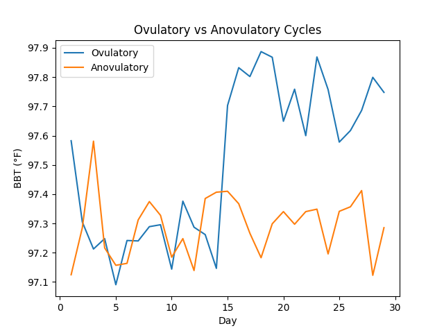

# ovulation-detection-bbt
Detecting ovulation using simulated basal body temperature data
## Example Visualization

## Overview

This project simulates basal body temperature (BBT) patterns based on hormonal changes and uses these patterns to detect ovulatory vs anovulatory cycles.

## Methods

- Converted cycle data into daily time-series format  
- Simulated temperature changes based on ovulation  
- Built a detection method using temperature trends  
- Added a confidence score to evaluate signal strength
  
## Data Source

Fertility & Menstrual Health Dataset (Kaggle)
